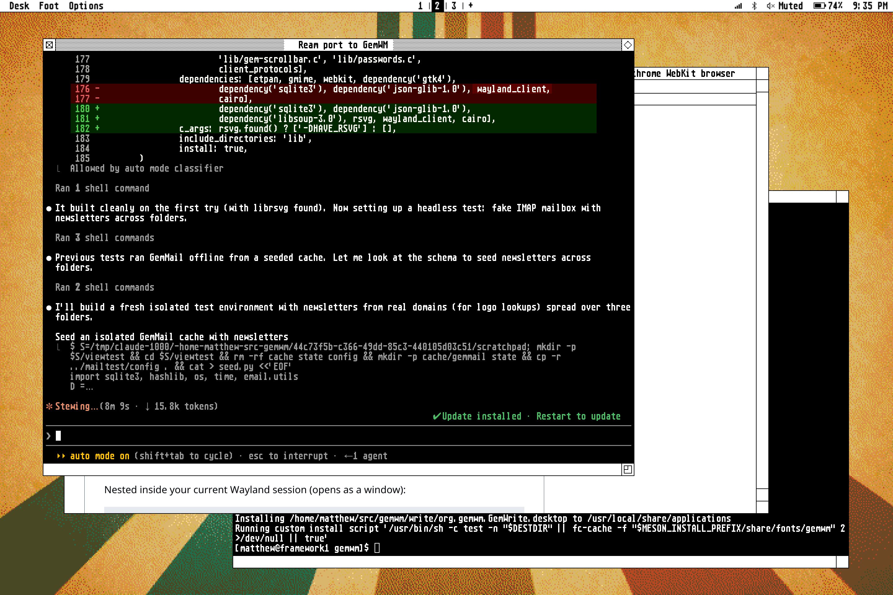

# GemWM

A Wayland compositor (wlroots 0.19, C) that looks like Atari TOS/GEM:
the green colour-ST desktop, a GEM menu bar, and black and white GEM
window frames.

GemWM is three programs (plus a terminal theme, below):

- `gemwm`: the compositor. Draws the desktop and window frames.
- `gemwm-menu`: the menu bar, a wlr-layer-shell client. `gemwm` starts
  it automatically (`-M` to skip).
- `gemweb`: a web browser with GEM chrome (optional, needs
  `webkitgtk-6.0`).

## Build

    meson setup build
    ninja -C build

## Install as a login session

    meson setup build          # installs under /usr/local by default
    ninja -C build
    sudo ninja -C build install

This installs `gemwm`, `gemwm-menu`, the `gemwm-session` launcher and
`/usr/share/wayland-sessions/gemwm.desktop`. Choose GemWM in your
display manager. The session log goes to `~/.local/state/gemwm.log`, and
`~/.config/gemwm/env` is sourced at startup for settings.

## Login screen

`gemwm-greeter` is GemWM's login screen, for
[greetd](https://sr.ht/~kennylevinsen/greetd/). GEM never had one (TOS
started straight into the desktop), so it's the desktop before anyone's
on it: the menu bar with only Desk (Restart, Shut Down), the clock and
battery, and the people who can log in as icons on the desktop, as the ST
showed its disk drives. Click one, or type a name, and a GEM dialog asks
for the password and which session to start (from
`/usr/share/wayland-sessions`). A wrong password is a GEM alert; anything
more PAM asks (a code from a key, say) is asked in the same dialog. It
remembers who logged in last, and with what.

greetd does the logging in; the greeter runs inside GemWM's greeter mode,
`gemwm -G`, which runs no key bindings and quits when the greeter does.
In `/etc/greetd/config.toml`:

    [default_session]
    command = "/usr/local/bin/gemwm -G /usr/local/bin/gemwm-greeter"
    user = "greeter"

Then make the directory it remembers in (or reboot), and restart greetd
(from a text console, or it ends your session):

    sudo systemd-tmpfiles --create
    sudo systemctl restart greetd

The desktop it shows is set in `/etc/gemwm/greeter.conf`, a `[desktop]`
section as in your own config; a picture has to be somewhere the greeter
user can read, not your home:

    [desktop]
    image = /usr/local/share/backgrounds/atari-wall.jpg
    dither = st16

## Run

Nested inside your current Wayland session (opens as a window):

    ./build/gemwm -s foot

The scale is picked from the screen's pixel density (a whole number, so pixels
stay crisp); `-S 2` forces pixel doubling.

| Keys                | Action                                   |
|---------------------|------------------------------------------|
| Super+T, Alt+Return | open a terminal (`$TERMINAL`, or the GEM one) |
| Super+B             | open the default browser                 |
| Print               | screenshot of the whole screen           |
| Shift+Print         | screenshot of an area you drag out       |
| Alt+Print           | screenshot of the focused window         |
| Volume keys         | volume up, down, mute; mic mute          |
| Super+Q             | close the focused window                 |
| Super+Z             | maximize the focused window (toggle)     |
| Super+F             | fullscreen the focused window (toggle)   |
| Super+Tab           | cycle windows (Shift goes backwards); window mode |
| Alt+Tab             | the same                                 |
| Super+Arrows        | focus the neighbouring tile or column    |
| Super+Ctrl+Arrows   | tiling: swap with the window that way; scrolling: move the column / the window |
| Super+Shift+Left/Right | tiling: push the window into the other column |
| Super+[ / Super+]   | scrolling: consume or expel the window   |
| Super+R             | scrolling: column width ⅓ → ½ → ⅔        |
| Super+1..9, Alt+1..9 | switch workspace                        |
| Super+Shift+1..9, Alt+Shift+1..9 | move the focused window to a workspace |
| Alt+Escape          | quit                                     |

While Super is held, the focused window gets a thick pink border.

Screenshots (also Options > Print Screen) are taken by `gemwm-screenshot
[screen|area|window]`, which needs `grim`, and `slurp` for areas. They're
saved to `~/Pictures/Screenshots` (or `$GEMWM_SCREENSHOT_DIR`), copied to
the clipboard if `wl-copy` is installed, and announced by your notification
daemon if one is running.

Environment:

- `GEMWM_DESKTOP`: overrides the desktop colour from the config (see
  [Desktop](#desktop)).
- `GEMWM_FONT`, `GEMWM_FONT_SIZE`: the font, if `[font]` in the config
  doesn't set it (see [Font](#font)).

## Menu bar

Hover a title to drop its menu; click an item to run it. Click the title
(or anywhere outside) to close it again; a click outside never reaches the
window underneath, as on the ST. At the right are the menu apps (below):
Bluetooth, the battery and the clock. Click the clock to switch between
24-hour and 12-hour time. The battery shows a bolt on mains power, and its
charge turns inverted at 10% or less; rest the pointer on it for how long
until it's empty, or full while charging.

As in GEM, the menu bar belongs to what's in front. With a window focused,
it shows **Desk**, a menu named after the window's application (from its
`.desktop` file: Firefox, Foot...), and **Options**. That menu has Close
Window, Full Size (checked when it is), and Move to Workspace. GemWM's own
applications add their menus after it: GemWeb's File, View and Go, and
Bluetooth's File, with its On/Off merged into the top of Options. Any
application can do the same with the `gemwm-app-menu-v1` Wayland protocol
(`protocols/gemwm-app-menu-v1.xml`), submenus included (since version 2). With no window focused, the bar shows the desktop's menus: Desk, File, View and
Options. Logout, Restart and Shutdown are at the bottom of Desk, so they're
always there.

The menus are built in, and `~/.config/gemwm/menu` changes them. You only
write what you want to change: a section replaces the built-in menu with the
same name, and every other menu stays as it is.

    # Replace the Internet submenu under Desk
    [Desk > Internet]
    Web Browser = chromium
    Mail = foot -e aerc
    Chat >
    -
    Downloads = foot -e yazi ~/Downloads

    # A submenu inside a submenu
    [Desk > Internet > Chat]
    IRC = foot -e weechat

    # An empty section hides a menu
    [View]

- `[Title]` is a menu in the bar; a new title adds a menu
- `[Title > Sub]` is a submenu, added at the end of Title unless Title has a
  `Sub >` line saying where it goes
- `Label = command` runs the command with `/bin/sh -c`
- `Label` alone is a disabled (grey) item
- `-` is a separator

The defaults are the TOS 1.0 desktop menus, plus some working items under
Desk: **Internet > Web Browser** opens GemWeb (or your default browser if
GemWeb isn't installed), **Internet > GemMail** opens GemMail (see
GemMail), **Office > GemWrite** opens GemWrite (see GemWrite),
**Tools > Terminal** opens `$TERMINAL` (foot
if unset), and **Tools > Printing** opens the printing window (see
Printing). The menu bar reads
its config at startup; restart it with `pkill gemwm-menu; setsid gemwm-menu &`.

### Menu apps

Everything at the right of the bar is a menu app: a small program with an
item there. They're listed in the same file, under `[Menu Apps]`, left to
right. As with menus, your section replaces the built-in one (so list the
ones you want to keep), and an empty section removes them all. The
defaults:

    [Menu Apps]
    Printing = exec gemwm-printing --menu-app
    Wi-Fi = exec gemwm-wifi --menu-app
    Bluetooth = exec gemwm-bluetooth --menu-app
    Volume = exec gemwm-volume --menu-app
    Battery = exec gemwm-battery
    Clock = exec gemwm-clock          # --12h or --24h, --seconds

`gemwm-clock` and `gemwm-battery` also take their settings from `[clock]`
and `[battery]` in `~/.config/gemwm/config` (see Key bindings).

A menu app runs as long as the bar does, and talks over its stdin and
stdout:

- Each line it prints replaces its item: `text`, `icon<TAB>text`, or
  `icon<TAB>text<TAB>inverse` for white text on black (as the battery shows
  when it's low). An empty line hides the item.
- A fourth field is a tooltip, shown under the item while the pointer
  rests on it: `icon<TAB>text<TAB>flags<TAB>tooltip`, where flags is
  `inverse` or empty.
- The icon is a PNG file, or an inline 1-bit picture, `bitmap:WxH:hex`:
  each row in hex, eight pixels to a byte, the first pixel in the top bit
  and 1 for black. Either way it's drawn 1:1, as it would be on the ST.
- A click on the item sends it `click 1` (`2` middle, `3` right), and
  each notch of the scroll wheel over it `scroll up` or `scroll down`.
- When its stdin closes, the bar has gone, and it should exit.

If an app exits after running at least 10 seconds, it's restarted; one that
dies right away is left alone (look in the session log).

A shell script is enough:

    #!/bin/sh
    # The load average, every 5 seconds; a click opens htop.
    while :; do cut -d' ' -f1 /proc/loadavg; sleep 5; done &
    ticker=$!
    while read -r click; do setsid foot -e htop & done
    kill $ticker

## Bluetooth

`gemwm-bluetooth` is a menu app. The bar shows the Bluetooth
rune, greyed when Bluetooth is off, and the name of what's connected. A click
opens a small window: turn Bluetooth on or off, **Scan** for devices, and
**Pair**, **Connect**, **Disconnect** or **Forget** them. Pairing codes are
shown, or asked about, in GEM alert boxes. It uses BlueZ (`bluetoothd`)
over D-Bus and needs GTK 4 to build; without a Bluetooth adapter, there's
no item.

## Key bindings

Keys are set in `~/.config/gemwm/config`. You only list what you change:
each line adds or replaces one binding, and `none` removes one.

    [keys]
    Super+Q = none                       # unbind
    Super+Return = exec foot             # run a program
    Super+W = close-window focused
    Super+Page_Down = workspace next
    Super+Page_Up = workspace prev
    Ctrl+Alt+Delete = quit

    [highlight]
    color = #ff3fa4                      # the border shown while Super is held
    width = 4                            # 0 turns it off
    tiling = super                       # or always: keep it on the focused tile
    dim = tiling                         # grey out unfocused windows: always, off
    dim-opacity = 0.5                    # 0..1, how strong the grey dots are

    [clock]
    mode = 24h                           # 12h, or off; click the clock to switch
    seconds = no

    [battery]
    mode = on                            # or off; hidden anyway without a battery

    [layout]
    mode = window                        # tiling or scrolling: the starting mode
    gap = 8                              # pixels between tiles and columns
    column-width = 0.5                   # scrolling: new columns' share of the screen

    [desktop]                            # see Desktop
    color = green
    image =
    image-mode = fill
    dither = off
    dither-style = diffuse
    pixel-size = 2
    resolution = off
    pattern = none

    [animation]
    mode = slide                         # outline (GEM's moving boxes), off
    duration = 200                       # ms; see Animation

    [font]                               # see Font
    family = Atari ST 8x16
    size = 16

    [ai]                                 # see AI
    enabled = true

Modifiers are `Super`, `Alt`, `Ctrl` and `Shift`; keys use xkb names
(`Q`, `Tab`, `Return`, `Page_Down`, `F1`, `1`...). An action is any
`gemwm msg` command (see below), plus `exec <command>` and `quit`.
Apply changes with `gemwm msg reload-config`; `[clock]` and `[battery]`
are read by the clock and battery menu apps when the menu bar starts them
(`pkill gemwm-menu; setsid gemwm-menu &`).

## Wi-Fi

`gemwm-wifi` is a menu app for iwd: signal bars in the bar, greyed when
Wi-Fi is off, with what it's connected to in the tooltip. A click opens a
window listing the networks in range, strongest first, with their signal,
a lock on those with a password, and Connect, Disconnect and Forget (for
saved ones); turn Wi-Fi on and off, and Scan. A new network's password is
asked for in a GEM alert box (Ctrl+V pastes). Enterprise (802.1X) networks
need setting up in iwd itself. Your user needs to be allowed to talk to
iwd: on Arch, being in `wheel` or `network` is enough.

## Printing

GemWM's own apps print through a GEM print dialog: pick the printer,
the copies and the pages (and the app's own options, like the crossword's
answers), or **PDF file** to save it in your Documents folder. Return
prints, Escape cancels, and the arrow keys go through the printers. It
remembers your choice until the app quits. Printers come from CUPS, and
the job goes straight to it: GemWM's apps skip xdg-desktop-portal, whose
print dialog GTK would otherwise show.

`gemwm-printing` is a menu app for whatever's printing, from any app. While
a job is printing, a printer shows in the bar, with the job in its tooltip;
if the printer needs you (out of paper, a jam, paused), that's shown in
inverse beside it. After the last job it stays half a minute, saying how it
went, then goes. A click (or Desk > Tools > Printing, any time) opens a
window: what's printing, with **Cancel**, what finished lately, and how each
printer is. It listens for CUPS's own signals on the system bus and asks
CUPS every couple of seconds only while something's printing. It's built
when GTK 4 and libcups are there.

## Volume

`gemwm-volume` is a menu app too: a speaker with the output's volume.
Scroll over it to turn it up and down, right-click to mute, and click for a
window with every output and input (the round buttons pick the default,
e.g. your headphones when they connect) and every application playing,
each with a GEM slider and Mute. The volume keys run `gemwm-volume up`,
`down`, `mute` and `mic-mute`, in 5% steps up to 100%, and the bar follows
at once. It uses PulseAudio, or PipeWire's PulseAudio server, and is built
when GTK 4 and `libpulse` are there.

## Notifications

`gemwm-notify` shows notifications as GEM would have: GEM had none, but
it had form_alert, so each is a small alert box that doesn't wait for
you, under the menu bar at the right. It has a close box, the app's name
and the time, the note icon (stop, for critical ones), and its actions
as buttons; click the body for the app's default action. Up to three show
at once, newest at the top; each goes after five seconds (or as long as
the app asks), but waits while the pointer's over it, and critical ones
stay until you close them.

A bell in the menu bar, with a count, shows only while there are
notifications you haven't seen: one you closed or clicked is seen, one
that just timed out isn't. Click it, or choose **Desk > Tools >
Notifications**, for the history (the last 200, kept in
`~/.local/state/gemwm/notifications`), which marks them all seen;
**File > Clear All** empties it. **Options > Do Not Disturb** there keeps
everything but critical notifications from popping up: they go quietly
into the history, and the bell shows they came.

D-Bus starts it the first time a program sends a notification, so no
other notification daemon should be installed: with mako, say,
`sudo pacman -R mako`, and log in again.

## Animation

In tiling and scrolling modes, changes to the layout are animated: a new
window, a swap or push, a window closing and the others closing up, Super+Z,
and in scrolling mode the strip moving to the focused column. There are two
styles:

    [animation]
    mode = slide              # or outline, or off
    duration = 200            # ms, how long each takes

- **slide** (the default): windows glide to their new places, quick to
  start and gentle to stop, and grow or shrink to their new sizes (the
  frame moves out or in, showing as much of the window as fits: nothing is
  stretched). A new window fades in, rising into its place.
- **outline**: the way GEM did it. Windows don't move: in tiling mode a
  window the layout moves or resizes is hidden while its outline (the one
  you drag windows by) steps from its old place to its new one, then it
  appears there, and a new window's outline grows from the middle of its
  place, as GEM opened windows from their icons. Scrolling mode still
  slides its strip, and new windows' outlines grow there too.
- **off**: everything jumps straight to its place.

Window mode isn't animated: its windows only move when you drag them, and
dragging already shows an outline.

## Crossword Puzzle

Desk > Games > Crossword Puzzle (`gemwm-crossword`, after MPOS's). The
library lists your puzzles by date with how far along each is; its
Download tab has the week's Wall Street Journal (Monday to Saturday) and
Universal (daily) puzzles, as Across Lite `.puz` files from the archive at
herbach.dnsalias.com. A puzzle opens between its Across and Down clues:
type to fill, arrows move (and turn), Space or clicking the current square
switches direction, Tab jumps to the next clue. Check Puzzle turns the
border green or red, and filling it in right turns it green by itself.
Progress is saved as you type. Puzzles and saves are in
`~/.local/share/gemwm/crossword/`; `gemwm-crossword FILE.puz` opens any
`.puz`. It needs GTK 4 and libsoup 3 to build.

File > Print... (Ctrl+P) prints the open puzzle the way a newspaper would:
the title and byline, the grid, and the clues in columns around it (going
on to a second page if they need to). The print dialog has "Include my
answers" to print what you've filled in. To make a PDF without the dialog: `gemwm-crossword --pdf OUT.pdf [--blank] FILE.puz` (with your
saved answers, unless `--blank`).

## Desktop

The desktop is set in `[desktop]` in `~/.config/gemwm/config`:

    [desktop]
    color = green             # or a name below, mono, or #rrggbb
    image = ~/Pictures/atari.png
    image-mode = fill         # fit, center, tile or stretch

The named colours are ST palette entries, colours a real ST could show:
`green` (the colour desktop's own), `dark-green`, `blue`, `navy`, `cyan`,
`teal`, `amber`, `red`, `purple`, `grey`, `dark-grey`, `white` and `black`.
`mono` is the high-resolution ST's 50% dither. An image (PNG, JPEG, WebP...)
is drawn over the colour; `center` and `tile` show it at one desktop pixel
per image pixel, and pixel art blown up 2x or more keeps its square pixels.

To see the desktop as an ST would have shown it, turn on dithering:

    [desktop]
    dither = st16             # st: the ST's 512 colours; st16: 16 of them,
                              # picked for the picture, as in low-res;
                              # atari16: a fixed, bold 16; off
    dither-style = diffuse    # diffuse: a fine speckle; ordered: the
                              # regular crosshatch of 80s computer art
    pixel-size = 2            # how big its pixels are, in desktop pixels
    resolution = 640x400      # or: size them so the screen is about this
                              # many across and down (overrides pixel-size)

`atari16` with `resolution = 640x400` is the busy, colourful look of a
photo on an ST in medium resolution.

The picture is redrawn in big pixels, in those colours, with patterns of
dots for the shades between them. It's done once, when the desktop
changes, so it costs nothing while you work, and windows stay sharp.

A GEM fill pattern can go over the colour, in black:

    [desktop]
    pattern = dots            # lines, vertical-lines, crosshatch, diagonal,
                              # checkerboard, bricks; none

Changes apply with `gemwm msg reload-config`.

## Font

Titles, menus and GemWM's own applications use the Atari ST's 8x16 system
font, at 16, the size it's drawn in whole pixels. If it's a bit much:

    [font]
    family = monospace        # any fontconfig family
    size = 14                 # 14 unless it's the ST font, which is 16

Window titles change on `gemwm msg reload-config`; programs already
running (the menu bar, GemWeb, Bluetooth...) keep their font until they're
started again (`pkill gemwm-menu; setsid gemwm-menu &` for the bar). The
terminal's font is set separately, in its theme.

## Workspaces

The middle of the menu bar shows the workspaces, `1 | 2 | +`. Click a
number to switch, or `+` to add one. Workspaces are dynamic: an empty
workspace is removed when you leave it, and the ones after it move up a
number. The number keys, with or without Shift, accept one past the last
workspace, which creates a new one.

## Tiling

Options > Mode switches between **Window** (overlapping GEM windows),
**Tiling** and **Scrolling** (below), with a check mark on the current one. In tiling mode windows
share the screen in two columns, each stacking its windows top to bottom,
`gap` pixels apart; dialogs float on top. A new window opens where you're
working, as in i3 and sway: the second window starts the right column, and
after that a new window splits the focused window's column, just below it.
A column left empty gives the other the whole width. Super+Ctrl+Arrows swap
the focused window with its neighbour that way; Super+Shift+Left/Right push
it into the other column, below the window beside it (only if its own
column keeps another; from a single column, it starts a second).
Super+Arrows move focus between tiles, which show the pink focus border
while Super is held, as in window mode (`[highlight] tiling = always` keeps
it on the focused tile), while the others are greyed out with GEM's dotted "disabled" pattern (clicks
go straight through it). Super+Z (or a tile's fuller) makes the focused
tile fill the screen; the other tiles stay open but hidden until Super+Z
again, a new window, or moving focus brings the layout back. Tiles can't be
dragged or resized; switching back to window mode returns every window to
where it was.

Changes to the layout are animated; see [Animation](#animation).

## Scrolling

The third mode, after niri. Each workspace is a strip of columns that
scrolls sideways; two half-width columns fill the screen, and the view moves
just enough to keep the focused column in sight, sliding there so you can
see where you went (see [Animation](#animation)). A new window opens as a
column to the right of the focused one.

- Super+Left/Right (or Super+mouse wheel) moves between columns,
  Super+Up/Down between the windows stacked in one.
- Super+[ and Super+] **consume or expel**: a window alone in its column
  joins the neighbouring column as a new row; a window sharing a column
  leaves it for a column of its own. Columns hold rows, nothing deeper.
- Super+Ctrl+Arrows move the focused column left/right, or the window
  up/down within its column.
- Super+R cycles the column between a third, a half and two thirds of the
  screen; Super+Z makes it full width and back.

## Scripting: `gemwm msg`

GemWM listens on a control socket (`$GEMWM_SOCKET`, set for everything it
starts). `gemwm msg` sends one command and prints the JSON reply:

    gemwm msg workspaces              # list workspaces and their windows
    gemwm msg windows                 # id, title, app_id, workspace, focused,
                                      # tiled, and the frame's x/y/width/height
    gemwm msg workspace 2             # also: new, next, prev
    gemwm msg move-window 12 3        # window id or "focused"; 3 or "new"
    gemwm msg focus-window 12         # switches to its workspace if needed
    gemwm msg maximize focused        # or an id; toggles, like Super+Z
    gemwm msg fullscreen focused      # or an id; toggles, like Super+F
    gemwm msg close-window focused
    gemwm msg cycle-windows next      # or prev, like Super+Tab
    gemwm msg mode scrolling          # window, tiling, toggle; alone: report
    gemwm msg focus-direction left    # right, up, down (tiling, scrolling)
    gemwm msg move-direction right    # scrolling: move column / window;
                                      # tiling: swap with that neighbour
    gemwm msg push-direction left     # tiling: into the other column
    gemwm msg consume-or-expel left   # scrolling
    gemwm msg column-width 0.33       # scrolling: or "cycle"
    gemwm msg exec foot               # run a program
    gemwm msg reload-config           # re-read ~/.config/gemwm/config
    gemwm msg quit
    gemwm msg subscribe               # stream workspaces/windows/mode events

Window ids never change while a window is open; workspace numbers are
positions. Errors print `{"error":...}` and exit with status 1. For example,
to send every terminal to workspace 2:

    gemwm msg windows | jq '.windows[] | select(.app_id=="foot") | .id' |
        xargs -I{} gemwm msg move-window {} 2

## Terminal

Super+T, Alt+Return and Desk > Tools > Terminal open `gemwm-terminal`:
[foot](https://codeberg.org/dnkl/foot) dressed as an Atari ST terminal, in
the ST's own 8x16 system font with the ST palette. There are two themes,
light (the mono monitor's black on white) and dark (reverse video):
Options > Terminal Theme switches every open terminal and remembers the
choice, and Ctrl+Shift+D flips a single window.

    gemwm-terminal                  # open one
    gemwm-terminal theme dark       # or light; what the menu does

It layers the theme over your own `~/.config/foot/foot.ini`, so your key
bindings and other settings still apply. To use another terminal instead,
set `TERMINAL` in `~/.config/gemwm/env`.

## GemWeb

A WebKit browser whose tabs, buttons and info line are drawn like GemWM's
windows. It's built when `webkitgtk-6.0` is installed. Video and sound need
GStreamer's plugins too, which distributions often leave optional
(`gst-plugins-base`, `gst-plugins-good`, `gst-libav`; add `gst-plugin-va`
for hardware decoding); when any are missing, GemWeb names them on its
new-tab page and in the info line, on a new window's first page and on
pages with video or sound.

    gemweb               # opens a new window
    gemweb URL...        # opens tabs in the last-used window
    gemweb --app URL [--name NAME]   # a web app in a window of its own

The tab bar appears once a window has two tabs; Ctrl+T opens the second.

To make it the system default browser, for links opened from other apps:
`xdg-settings set default-web-browser gemweb.desktop`. Desk > Internet >
Web Browser always opens GemWeb.

| Keys                        | Action                    |
|-----------------------------|---------------------------|
| Ctrl+T / Ctrl+W             | new tab / close tab       |
| Ctrl+L, F6                  | edit the address          |
| Ctrl+Tab, Ctrl+Shift+Tab    | next / previous tab       |
| Alt+Left / Alt+Right        | back / forward            |
| Ctrl+R, F5                  | reload                    |
| Ctrl+Shift+R, Shift+F5      | reload from the site      |
| Ctrl+plus / minus / 0       | zoom                      |
| Ctrl+P                      | print                     |
| Ctrl+F                      | find in the page          |
| Ctrl+G, F3 (with Shift)     | next (previous) match     |
| Ctrl+Alt+R                  | Reader View               |

Middle-click or Ctrl+click opens a link in a background tab; middle-click a
tab to close it. Text that isn't an address is searched. Downloads go to
`~/Downloads`; cookies and site data live in `~/.local/share/gemweb`.

The home page and search engine are set in `~/.config/gemweb/settings`
(changes apply to the next page loaded, no restart needed):

    [General]
    home = https://example.com/
    search = kagi

`home` is an address, or `start` for GemWeb's own start page; it's Google
if unset. `search` is `duckduckgo` (the default), `google`, `bing`,
`brave`, `startpage` or `kagi`, or any search URL with `%s` where the query
goes, like `https://search.example/?q=%s`. `$GEMWEB_HOME` and
`$GEMWEB_SEARCH`, if set, take precedence.

### Web apps

`gemweb --app URL` opens a site as an app of its own: a window with just
the page, no tabs, address field or info line (it appears only for a
download or a notice), named in the menu bar after `--name` (or the site:
`x.com` is X). It shares the browser's logins. Links to other sites open in
the browser; the app's own pages, redirects and pop-ups, like signing in,
stay in its window. File > Open in Browser takes the page there, and Go >
Home goes back to URL. Running it again brings its window forward. To put
one in the Desk menu:

    [Desk > Internet]
    Twitter = gemweb --app https://x.com --name Twitter

### Ad blocking

GemWeb blocks ads and trackers with [EasyList](https://easylist.to) and
EasyPrivacy, the lists most ad blockers use. It converts them to WebKit's
own content-blocking rules, which WebKit compiles and applies itself, so
pages load no slower. The lists are fetched again every four days, in the
background; the compiled rules (about 55 MB) live in
`~/.local/share/gemweb/adblock`.

View > Block Ads turns it on or off everywhere, and View > Block Ads on
*site* turns it the other way for the site you're on (and its subdomains),
reloading the page. Both are kept in the settings file:

    [Ad Blocking]
    enabled = true
    lists = https://easylist.to/easylist/easylist.txt;https://easylist.to/easylist/easyprivacy.txt

    [Ad Blocking Sites]
    example.com = false

`lists` takes any lists in Adblock Plus's format, separated by `;`. Filters
WebKit can't express (regular expressions, `$csp`, `$redirect`, scriptlets,
extended selectors) are left out.

### Passwords

GemWeb fills in logins from a password manager's command-line tool. For
Bitwarden, with `bw` installed and logged in (`bw login`) and `jq`:

    [Passwords]
    command = gemweb-bw
    unlock = gemweb-bw --unlock

A key gadget appears at the right of the toolbar on pages with a login
field; press it (or Go > Fill Password) and GemWeb fills the username and
password, from a list if the site has several logins. The first time, it
asks for your master password; the session stays unlocked, in memory only,
until GemWeb quits or Go > Lock Passwords. Nothing is filled until you ask,
only into the page the logins were looked up for, never into an embedded
frame, and never into a plain http page other than `localhost`.

Other password managers need a small script. GemWeb runs `command HOST`
(directly, not through a shell) and reads one login per line: name,
username and password, tab-separated, with tabs, newlines and backslashes
escaped as `\t`, `\n` and `\\` (jq's `@tsv`). It exits 3 if the vault is
locked. `unlock` reads the master password as a line on stdin and prints a
session key, which later lookups get as `$GEM_PASSWORD_SESSION`; on
failure it exits non-zero with a line on stderr. See `browser/gemweb-bw`.

The address field completes from history: typing the start of a site you've
visited fills in the rest (selected, so typing on replaces it), and a list
of pages drops down, matching the start of an address or any words in its
address or title, most visited (and most typed) and most recent first. Up
and Down choose from the list (Down in an untouched field lists your top
pages), Shift+Delete forgets the chosen page, and Escape closes the list.
History is kept in `~/.local/share/gemweb/history.sqlite`, to the top 5,000
pages; Go > Clear History... empties it.

Right-clicking opens a GEM menu for what's under the pointer: a link (open
it in a new tab or window, copy its address, download it), an image or a
video, a text field (undo, cut, copy, paste, select all), selected text
(copy it, or search the web for it), or the page (back, forward, reload,
Reader View, print); Inspect Page opens WebKit's inspector. A page's own
`alert()`, `confirm()` and `prompt()`, and "Leave this page?", come up as
GEM alert boxes naming the site that asks.

File > Print... (Ctrl+P) prints the page with GemWM's print dialog (see
[Printing](#printing)), to a printer or a PDF in Documents; in Reader View
it prints just the article.

Ctrl+F opens a find bar along the bottom of the window. It finds as you
type, ignoring case, and counts the matches; Return and Shift+Return (or
its arrow gadgets) go to the next and previous match, and Escape closes it.

View > Reader View (Ctrl+Alt+R) shows just a page's article: the text and
its pictures, in a white box on the desk, headed in GemWM's font, with the
site's scripts and styles left out. Choose it again to go back to the page.
It uses Mozilla's Readability.js, the library behind Firefox's Reader View
(in `browser/readability`, Apache 2.0); a page that doesn't look like an
article, such as a home page, says so in the info line instead.

Under GemWM a page scrolls with the window frame's own scroll bars, and its
built-in scroll bar is hidden; elsewhere, pages get GEM-styled scroll bars.

## GemMail

GemMail (`gemmail`) reads and sends email over IMAP and SMTP. Folders are on the
left, with their unread counts; the main pane lists a folder's newest
messages (a diamond marks unread ones), and opening one (double-click or
Return) shows it in that same pane, with Back, Reply, Reply All, Forward,
Archive and Delete above it, and its attachments as buttons that save them
in Downloads. A message with pictures attached (PNG, JPEG, GIF, WebP...)
has **Show Attached Images**, which shows them under its text. Escape goes back to the list.

Archive (A) moves a message to the folder the server flags as the archive
(`\Archive`, or Gmail's All Mail), else one called Archive, which is made
the first time it's needed; Delete moves it to Trash (and out of Trash,
deletes it for good). Either way, reading, the next message opens.
**File > Empty Trash...** deletes everything in Trash for good, on the
server too, once you've said so.
In the list, Shift-click (or Shift+Up/Down) selects a run of messages,
Ctrl-click adds or removes one, and Ctrl+A selects them all; Archive,
Delete and Mark as Read (^U: read, or unread if they all are) then act on
all of them at once. To put messages in another folder, drag them onto it
in the folder list, or choose **Move to Folder...** (M) and pick it from
the dialog's pop-up.
It checks for new mail every three minutes, or on F5.

Mail is kept in `~/.cache/gemmail`: each folder's newest 1000 messages
are listed, and the newest 100 of the folder you're in are fetched ahead,
so GemMail opens showing your mail as it was left, then asks the server
only what's changed (new mail, what's gone, what's been read elsewhere:
CONDSTORE, where the server has it). Without a connection, what's cached
still reads. Deleting the folder only makes the next start slower.

With AI (through Augur; see AI), GemMail can sort your mail into
categories, like Bill, Newsletter or Shipping; a message can be in several.
It's off until you choose **Options > Categorize with AI**, since it sends
the sender, subject and the first part of each message's text to your AI
provider. Then the newest messages of the folder you're looking at (the
ones already downloaded to read offline) are categorized in the
background, a few at a time: each row shows its categories, and they're
listed under the folders with how many this folder has. Click one (or pick
it in **View > Categories**) to see only those; click it again, or pick
All Messages, for all. While it works, the right of the
status line says how far it's got ("Categorizing: 8 of 20 done"), and a
message still to be done has a dotted box where its categories will go;
once done, a message with none is one no category fitted. If the AI
can't be reached, the status line says why, and it tries again in five
minutes.

**Message > Categories...** puts the selected messages in categories
yourself: what you choose is kept, never changed by AI, and your latest
choices go to the model as examples. The categories, and what each is
for, are in `~/.config/gemmail/categories` (written with defaults when you
first turn it on): the descriptions are what the model goes by, so make
them say what belongs there. Change them and mail is categorized again.

Where Augur has a classifier (Typesafe's Jev: `classifier =` in a
profile), it does the categorizing: each category a yes-or-no question
about each message, answered with how likely it is, a message going in
the categories it's at least 80% sure of. It's quick (about half a
second a message) and cheap (a few thousandths of a cent). Which
profile's classifier is Augur's business (`classify-profile =` under
`[app org.gemwm.GemMail]` in its config). Without one, a chat model
categorizes, a batch at a time, with your choices as examples;
`model =` or `tier =` under `[Categories]` in the categories file picks
it. GemMail finds out which it has when it starts categorizing, and
switching between them categorizes again.

**View > Views > Newsletters** (or Newsletters, under the folders) shows your
Newsletter mail as a magazine rack, from every folder that's been
categorized so far: an icon for each publication, newest first, with how
many issues you haven't read. Open one for its issues, and an issue to read
it, in its own folder, so Reply, Archive and the rest work as ever; Back
(Esc) goes back to the rack. The icons are the publications' own logos:
the one a domain publishes for its mail (BIMI), else its website's icon,
else its initials. Only the sending domain is looked up, never anything
from the message, and logos are kept in `~/.cache/gemmail/logos` (SVG
ones need librsvg).

**View > Views > Bills** shows your Bill mail as a ledger, a month at a time,
newest first: each bill's due date, payee, what it's for and the amount,
read from the bill by AI in the background (a few at a time, from mail
already downloaded), and each month's total and what's still unpaid.
Reminders of the same bill (same payee, due date and amount) are one row;
mail that only confirms a payment is left out. Tick a bill's box (or
press Space) when you've paid it; one that says it's paid automatically
shows **Auto**, and one past due and unpaid, **Overdue**. Return or a
double-click opens the bill, in its own folder.

An HTML message runs no scripts and loads nothing from the web (no
tracking pixels) until you press **Show Images**, for that message, or
**Always for** its sender, which shows that address's images from then on
(**Stop Showing Images** takes it back; the list is
`~/.config/gemmail/show-images`). A trusted sender's images still wait if
your mail server's `Authentication-Results` header says the message may
not be theirs: neither DMARC nor a DKIM signature from their domain passed.
Its links open in the browser, and `mailto:` ones start a new message. Messages are written as
plain text, and sent copies are kept in Sent.

It's built when libetpan (IMAP and SMTP), GMime 3 and WebKit are
installed (`pacman -S libetpan gmime3 webkitgtk-6.0`). The account goes in
`~/.config/gemmail/settings`:

    [Account]
    from = Jane Doe <jane@example.org>
    user = jane@example.org             # the login; the From address if unset
    imap = imaps://imap.example.org     # imaps: TLS; imap: STARTTLS (:port)
    smtp = smtps://smtp.example.org     # smtps: TLS; smtp: STARTTLS (:port)
    password-command = pass show mail   # prints the password

The password command runs when the app connects (anything that prints the
password: `pass`, `secret-tool lookup ...`); if it fails, a GEM dialog
asks, and the password is kept in memory only. A password manager that
locks, like Bitwarden, works as it does for GemWeb (see Passwords), in
place of `password-command`:

    [Passwords]
    command = gemweb-bw
    unlock = gemweb-bw --unlock
    site = example.org                  # optional: the IMAP server's name

With Bitwarden, `command = gemweb-bw --item "Item name"` picks one item by
its name instead, whatever website it's saved for.

GemMail looks up the site's login whose username is yours; when the
vault's locked, a GEM dialog asks for the master password first, and it
stays unlocked (in memory) while GemMail runs.
Connections are always encrypted, and the server's certificate checked
(GIO's TLS, against the system's certificates); for a server with a
self-signed one, `certificate = ~/server.pem` trusts that one. Sent and
Trash are found by the flags servers give them, or by name, or `sent =`
`trash =` and `archive =`.

## GemWrite

GemWrite (`gemwrite`, Desk > Office) is a word processor. Pages show as
they'll print, in the document's own fonts, on GEM's grey; everything
around them is GEM: the menus in the bar, a ruler, GEM's scroll bars, and
an info line with the word count and the zoom. Documents are OpenDocument
Text (`.odt`, as LibreOffice and Word read) or plain `.txt`. Its core, the
document, layout, file formats and commands, is forked from Ream.

- **File**: New (another window), Open..., Save, Save As..., Revert to
  Saved, Export as Markdown... or PDF..., Print... (GemWM's print dialog,
  or a PDF in Documents). Files are picked in GEM's item selector: edit
  the directory line to go elsewhere or change its pattern, double-click
  a folder to go in, the list's close box goes up.
- **Edit**: Undo, Redo, the clipboard, Find... (^F) and Replace... (^H) in
  a box that stays up while you work, every match boxed, Find Next (^G),
  and Add Comment (^Alt+M).
- **Style**: Bold, Italic, Underline, Font... (every family, the size and
  a sample), Larger and Smaller (^] and ^[), and the paragraph styles:
  Body Text, Title, Heading 1-3, Quote (a block quotation) and Note (a
  tinted callout), ^Alt+0, T, 1-3, Q and N.
- **Format**: alignment, line spacing (^1, ^5, ^2), Indent More and Less
  (^M, ^Shift+M), Clear Tab Stops, and bulleted and numbered lists
  (^Alt+8, ^Alt+7). In a list, Tab and Shift+Tab nest and unnest an item,
  and Return on an empty one leaves the list.
- **View**: the ruler, the comments, and zoom (^+, ^-, ^0 to fit).

On the ruler, drag the bottom-left marker for the left indent, the
top-left one for the first line and the right one for the right indent;
click the scale to add a tab stop, drag one to move it or off the ruler to
remove it. It measures in inches or centimetres, as your locale does.

Select some text and a Comment button appears beside it (or right-click,
or ^Alt+M); the comments are cards at the right, with Reply and Delete.
Click a card to select its text, click its words to edit them. Comments
are signed with your name (or `author`, below), and they're OpenDocument
annotations, so LibreOffice and Word show them too. They're marked on the
screen, not on paper.

Spelling is checked as you type (a zigzag under words the dictionary
doesn't know); right-click one for corrections, Add to Dictionary and
Ignore Word. Dictionaries are enchant's, as GNOME's apps use: any hunspell
dictionary works (`pacman -S hunspell-en_us`), and the language follows
your locale unless `~/.config/gemwrite/settings.ini` says otherwise (no
comments on the same line as a setting, here):

    [general]
    author = Jane Doe
    spell-language = en_GB

`author` signs your comments. Options has Check Spelling, Autosave
(writes the file shortly after each change) and Sync with File: another
program writing the file shows "Changed on disk" on the info line with
Reload, and with Sync on it's read again by itself whenever nothing's
unsaved.

`gemwrite-cli` edits documents without a display, with the same commands,
which makes it handy for scripts, and for an agent to edit or comment on
what you have open (with Sync on, it appears as it's made):

    gemwrite-cli --list                                # every command
    gemwrite-cli notes.odt info                        # words, pages...
    gemwrite-cli notes.odt find "First" bold save
    gemwrite-cli --author Reviewer notes.odt find "Main" comment-add "Right word?" save
    gemwrite-cli notes.odt export-pdf notes.pdf

See `gemwrite-cli(1)`. GemWrite is built when GTK 4, libxml2, libarchive
and enchant are there (`pacman -S libxml2 libarchive enchant`); `meson
test` runs its core's tests.

## Passphrases

`pass` and `gpg` ask for your key's passphrase through a pinentry, and
GnuPG's own want X or a terminal. A program run with neither (GemMail's
password command, Augur's key command) then can't ask, and fails until
you've unlocked the key somewhere else. `pinentry-gem` asks in a GEM alert
box instead, on Wayland. Point GnuPG at it in `~/.gnupg/gpg-agent.conf`:

    pinentry-program /usr/local/bin/pinentry-gem

then `gpgconf --kill gpg-agent` (it starts again when next needed). The
first program to need the key gets the box; after that, the agent's cache
(`default-cache-ttl`, in the same file) answers. With no Wayland display,
over SSH say, it hands over to `pinentry-curses`.

`gemwm-session` also tells programs started in the background that the
session is graphical (`XDG_SESSION_TYPE`), which GnuPG's pinentries that
can do Wayland look for.

## AI

GemWM's programs get AI from [Augur](https://github.com/matthewp/augur), a
service any program on the session bus can ask: the providers, keys and
models are set up in Augur's own config (`~/.config/augur/config`), not
here. With Augur installed and set up, programs show their AI features;
they ask Augur whether it's on.

To turn AI off for the whole session:

    [ai]
    enabled = false

`gemwm-session` reads this when you log in and tells Augur (by
`AUGUR_DISABLED` in the session's environment), so it says it's off to
every program that asks. It takes effect at the next login.

## Windows

- Drag the title bar to move: an outline follows the pointer and the window
  moves on release, as in GEM.
- Sizer (bottom right) resizes the same way.
- Closer (top left) closes, fuller (top right) toggles full screen size.
- An application can bring its own window forward (xdg-activation), as
  GemWeb does when asked to open a link: the window is focused, on its
  workspace.
- Fullscreen (a video, a browser's F11, a game, or Super+F) covers the
  whole screen, menu bar and all, without a frame. Focusing another window
  on that workspace brings it back out, into its old place.
- Scroll bars are real GEM ones, for applications that drive them through
  the `gemwm-scroll-v1` protocol (`protocols/gemwm-scroll-v1.xml`), as GemWeb
  does: drag the slider, click the arrows to step, or click the track to
  page. As in GEM, windows whose applications don't use it have no scroll
  bars, just a thin border and the sizer.
- Clicking a background window only brings it to the top.

## License

BSD 3-Clause, see [LICENSE](LICENSE), except for two pieces that keep
their own licenses:

- `protocols/wlr-layer-shell-unstable-v1.xml`, vendored from wlroots
  (license in the file)
- `extras/fonts/`, the Atari ST font, built from EmuTOS and so under the
  GPL, version 2 or later (see `extras/fonts/README.md`). It is installed
  as a font file for the terminal and is not part of the GemWM programs.
